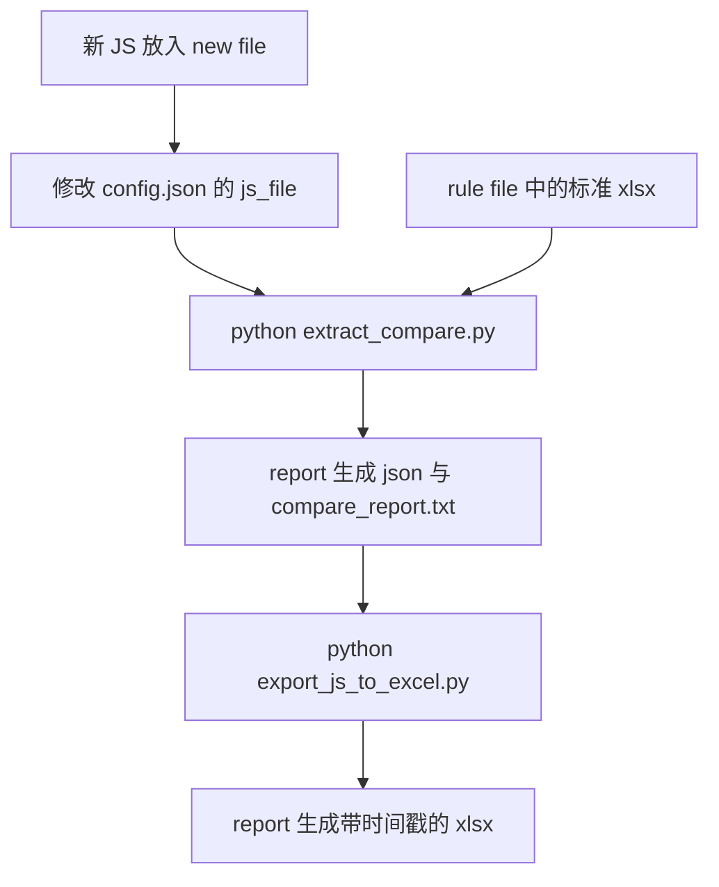

# GrandHub 翻译词条提取与对比 — 操作文档

本文说明如何从 `language-*.js` 提取中英词条、与标准 Excel 对比，并导出带时间戳的对照表。

---

## 1. 目录说明

所有路径均相对于本工具根目录（与 `config.json` 同级）。

```
翻译及词条文件对比/
├── config.json              # 路径与输出配置（换版本主要改这里）
├── extract_compare.py         # 步骤 1：提取 + 对比
├── export_js_to_excel.py      # 步骤 2：导出 Excel
├── i18n_config.py             # 配置读取（无需手动修改）
├── doc/
│   └── 操作文档.md            # 本文档
├── new file/                  # 【输入】待提取的 language-*.js
├── rule file/                 # 【规范】标准对照 Excel
└── report/                    # 【输出】json / 报告 / xlsx
```

| 文件夹 | 用途 |
|--------|------|
| `new file` | 放置每次打包后的新 `language-xxxxx.js` |
| `rule file` | 放置标准对照表（如 `GrandHub_AI_V1.1_新增中文词条.xlsx`） |
| `report` | 脚本生成的结果，勿与输入混放 |

各子目录内有 `README.txt` 可作快速提示。

---

## 2. 环境准备（首次使用）

1. 安装 **Python 3**（建议 3.10+）。
2. 安装 **Node.js**（用于解析 JS 对象，需可在命令行执行 `node -v`）。
3. 安装 Python 依赖：

```powershell
pip install openpyxl
```

---

## 3. 配置文件 `config.json`

换 JS 版本或标准表时，优先修改此文件后保存。

```json
{
  "paths": {
    "js_dir": "new file",
    "js_file": "language-B1vEaFmS.js",
    "rule_dir": "rule file",
    "standard_xlsx": "GrandHub_AI_V1.1_新增中文词条.xlsx",
    "output_dir": "report"
  },
  "output": {
    "xlsx_add_timestamp": true,
    "timestamp_format": "%Y%m%d_%H%M%S"
  },
  "compare": {
    "enabled": true
  }
}
```

### 字段说明

| 字段 | 说明 |
|------|------|
| `paths.js_dir` | JS 所在目录，默认 `new file` |
| `paths.js_file` | JS 文件名；留空 `""` 则自动选用 `js_dir` 下最新的 `language-*.js` |
| `paths.rule_dir` | 标准表目录，默认 `rule file` |
| `paths.standard_xlsx` | 标准表文件名（在 `rule_dir` 下） |
| `paths.output_dir` | 输出目录，默认 `report` |
| `output.xlsx_add_timestamp` | 为 `true` 时，导出的 xlsx 文件名末尾带时间戳 |
| `output.timestamp_format` | 时间戳格式，默认 `%Y%m%d_%H%M%S` |
| `compare.enabled` | 为 `false` 时只提取词条，不与标准表对比 |

路径可为相对路径（相对工具根目录）或绝对路径。

---

## 4. 下次更换 JS 文件 — 标准流程

### 4.1 放入新文件

1. 将新的 `language-xxxxx.js` 复制到 **`new file`** 文件夹。
2. 打开 **`config.json`**，将 `js_file` 改为新文件名，例如：

```json
"js_file": "language-C3xYzAbC.js"
```

若希望始终自动用最新文件，可设为：

```json
"js_file": ""
```

### 4.2 检查标准表（一般不用改）

确认 **`rule file`** 中已有标准 Excel，且 `config.json` 里 `standard_xlsx` 名称一致。

若更换了标准表文件，同步修改 `standard_xlsx` 即可。

### 4.3 打开终端并进入目录

在 PowerShell 或 CMD 中执行（请按本机实际路径修改）：

```powershell
cd "D:\新包验证\AI-GrandHub项目\AI-GrandHub V1.1\Beta\测试记录\翻译及词条文件对比"
```

### 4.4 执行两条命令

```powershell
# 步骤 1：提取中英词条，并与标准表对比
python extract_compare.py

# 步骤 2：导出 Excel（表头与标准表一致，文件名带时间戳）
python export_js_to_excel.py
```

### 4.5 查看结果

在 **`report`** 目录中查看：

| 生成文件 | 说明 |
|----------|------|
| `{js名}_zh_en.json` | 全部路径级中英配对 |
| `{js名}_compare_report.txt` | 与标准表的差异报告（一致 / 不一致 / 仅 JS 有 / 仅标准有） |
| `{js名}_中英对照_yyyyMMdd_HHmmss.xlsx` | 两列中英对照，便于 Excel 人工对比 |

示例：

- `language-B1vEaFmS_zh_en.json`
- `language-B1vEaFmS_compare_report.txt`
- `language-B1vEaFmS_中英对照_20260522_153045.xlsx`

---

## 5. 可选：命令行临时指定（不改 config）

```powershell
# 指定 JS 文件（优先在 new file 目录查找）
python extract_compare.py language-新哈希.js

# 指定 JS + 标准表
python extract_compare.py language-新哈希.js 其它标准表.xlsx

# 使用其它配置文件
python extract_compare.py -c D:\path\to\config.json

# 导出 Excel（需先完成 extract_compare.py）
python export_js_to_excel.py language-新哈希.js
```

---

## 6. 流程图



---

## 7. 常见问题

### 7.1 提示「JS 文件不存在」

- 确认文件在 **`new file`** 下，且 `config.json` 中 `js_file` 名称拼写正确（含大小写、后缀 `.js`）。

### 7.2 提示「未找到配置文件」

- 确认在工具根目录执行命令，且存在 `config.json`。

### 7.3 未生成对比报告 / 对比条数为 0

- 确认 **`rule file`** 中有标准 xlsx，且 `compare.enabled` 为 `true`。
- 确认 `standard_xlsx` 文件名与磁盘一致。

### 7.4 Node 相关报错

- 在终端执行 `node -v` 检查是否已安装 Node.js。
- 确保 JS 为 vue-i18n 打包格式（含 `const Xe=` 英文包与 `Ke={global:` 中文包）。

### 7.5 标准表与 JS 中文键不一致

对比以**中文完全一致**为键。Excel 中带空格（如 `光圈 +`）与 JS 中无空格（`光圈+`）会分别计入「仅标准有」「仅 JS 有」，属正常现象；可在对比前统一空格规范，或在报告中按路径核对。

### 7.6 不想在 xlsx 文件名加时间戳

在 `config.json` 中设置：

```json
"xlsx_add_timestamp": false
```

---

## 8. 维护建议

- **输入**：只往 `new file` 放 JS，避免根目录堆积旧文件。
- **规范**：标准表仅放在 `rule file`，版本更新时替换或改名并改 `config.json`。
- **输出**：`report` 中历史 xlsx 可定期删除，只保留最新一次；json 与 txt 可按版本命名区分。
- **脚本**：勿删除 `config.json`、`i18n_config.py` 及两个 `python` 脚本。

---

## 9. 快速检查清单

- [ ] 新 `language-*.js` 已放入 `new file`
- [ ] `config.json` 中 `js_file` 已更新（或已留空自动选最新）
- [ ] `rule file` 中标准 xlsx 存在
- [ ] 已执行 `python extract_compare.py`
- [ ] 已执行 `python export_js_to_excel.py`
- [ ] 已在 `report` 中查看 json / 报告 / xlsx

---

*文档版本：与目录规范（new file / rule file / report + config.json）一致。*
